# 录音任务平台 Web 端用户操作手册

> 适用版本：2026-08-03
>
> 使用对象：管理员（ADMIN）、审核员（REVIEWER）
>
> 线上入口：https://record.xiangtianzhen.store

本手册介绍录音任务平台 Web 端的日常操作。管理员负责创建任务、准备数据、配置采集权限、管理账号、查看统计和处理审核；审核员主要负责领取并审核录音结果。

## 目录

- [1. 角色与使用范围](#1-角色与使用范围)
- [2. 登录、首次改密与会话接管](#2-登录首次改密与会话接管)
- [3. 管理员数据大屏](#3-管理员数据大屏)
- [4. 创建和管理录音任务](#4-创建和管理录音任务)
- [5. 准备和维护任务数据](#5-准备和维护任务数据)
- [6. 配置采集权限](#6-配置采集权限)
- [7. 审核录音结果](#7-审核录音结果)
- [8. 查看采集员统计](#8-查看采集员统计)
- [9. 使用语音生成](#9-使用语音生成)
- [10. 管理用户和邀请码](#10-管理用户和邀请码)
- [11. 查看操作记录和个人账号](#11-查看操作记录和个人账号)
- [12. 常见问题](#12-常见问题)
- [13. 截图索引](#13-截图索引)

## 1. 角色与使用范围

| 功能 | 管理员 | 审核员 |
|---|---:|---:|
| 数据大屏 | 可用 | 不可用 |
| 任务管理、数据池、采集权限 | 可用 | 不可用 |
| 录音审核 | 可用 | 可用 |
| 采集员统计 | 可用 | 不可用 |
| 语音生成 | 可用 | 不可用 |
| 用户、邀请码、操作记录 | 可用 | 不可用 |
| 当前账号信息与退出登录 | 可用 | 可用 |
| 左侧“个人账号”页面 | 不显示 | 可用 |

页面只会展示当前账号有权使用的菜单。看不到某个入口通常是角色权限限制，不代表页面加载失败。

## 2. 登录、首次改密与会话接管

### 2.1 登录

适用角色：管理员、审核员。

1. 打开线上入口。
2. 在“账号”中输入后台登录账号。
3. 在“密码”中输入密码；可点击输入框右侧眼睛图标显示或隐藏密码。
4. 点击“登录”。

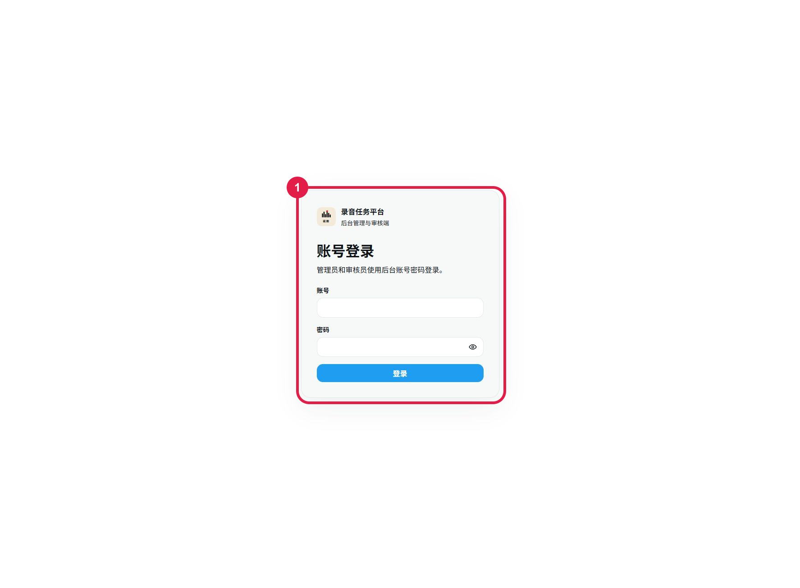

图中红框 1：输入账号和密码后点击“登录”。不要在公共电脑保存密码。

### 2.2 首次登录选择

管理员创建或重置的后台账号可能使用初始密码。登录后系统会询问是否修改：

- 选择“修改密码”：进入“设置新密码”，输入并确认新密码，保存后需要重新登录。
- 选择“暂不修改”：继续进入系统，并永久清除本次首次改密提示。

新密码至少 8 个字符。为避免 BCrypt 长度限制，不要使用 UTF-8 编码后超过 72 字节的超长密码。

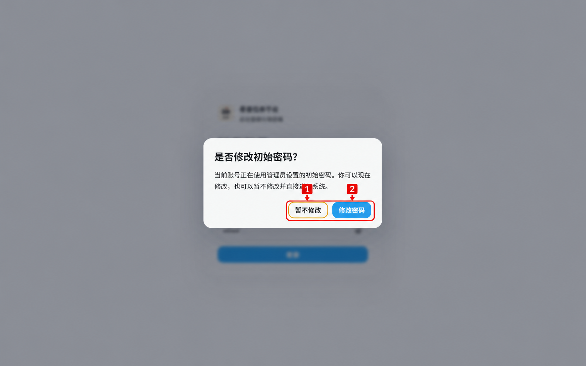

图中编号 1：暂不修改并直接进入系统；编号 2：进入新密码设置页。初始密码仍应尽快更换，并避免多人共用同一后台账号。

### 2.3 账号正在其他设备使用

同一个后台账号只允许一个活动会话。出现“是否强制登录？”时：

1. 确认当前确实需要接管该账号。
2. 点击“确认登录”。
3. 原设备会在下一次请求时退出登录。

如果不确定原设备是否仍在使用，请取消接管并联系管理员核实。

### 2.4 会话失效

会话过期、账号被停用、密码被重置或被其他设备接管后，系统会返回登录页。重新登录即可；不要反复刷新或重复提交原操作。

## 3. 管理员数据大屏

适用角色：管理员。

入口：左侧菜单“数据大屏”。

数据大屏用于快速了解当前业务状态，包括：

- 任务生命周期数量。
- 条目状态分布。
- 当前采集人数。
- 当前业务日首次提交数量。
- 最近 7 个业务日首次提交趋势。
- 最多 8 个任务的完成排行。
- 最近操作记录。

点击“刷新数据”会重新读取服务器数据。刷新失败时页面会保留上一次已显示的内容。

> 业务日按 Asia/Shanghai 凌晨 4 点换日。例如 8 月 2 日业务日表示 8 月 2 日 04:00 至 8 月 3 日 04:00；凌晨 0–3 点仍属于前一业务日。

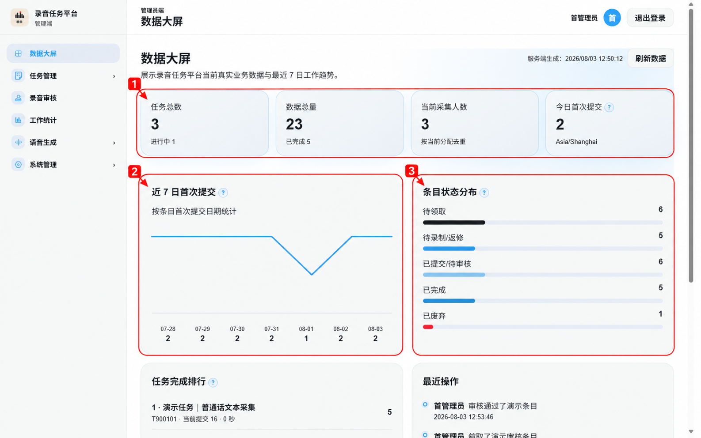

图中编号 1：任务、数据、采集人数和今日提交指标；编号 2：最近 7 日首次提交趋势；编号 3：当前条目状态分布。

## 4. 创建和管理录音任务

适用角色：管理员。

入口：左侧菜单“任务管理” → “任务管理”。

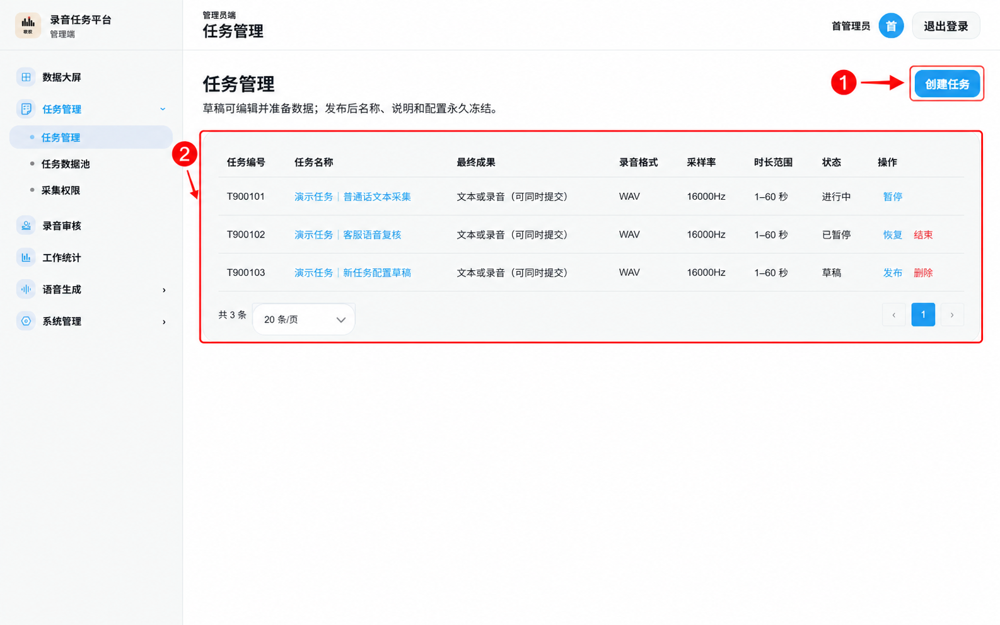

图中编号 1：创建新任务；编号 2：查看现有任务的编号、配置摘要、状态和可用操作。

### 4.1 创建任务

1. 点击“创建任务”。
2. 填写任务名称和说明。
3. 选择至少一种参考内容：文本、音频或视频。
4. 选择最终成果类型：
   - 文本成果：采集员可提交文本、录音，或同时提交两者。
   - 音频成果：采集员必须提交录音，不能夹带文本。
5. 设置是否启用人工审核。
6. 设置录音格式、采样率、单声道和允许的时长范围。
7. 保存草稿。

任务编号由系统自动生成，格式类似 T000001，无需手工填写。

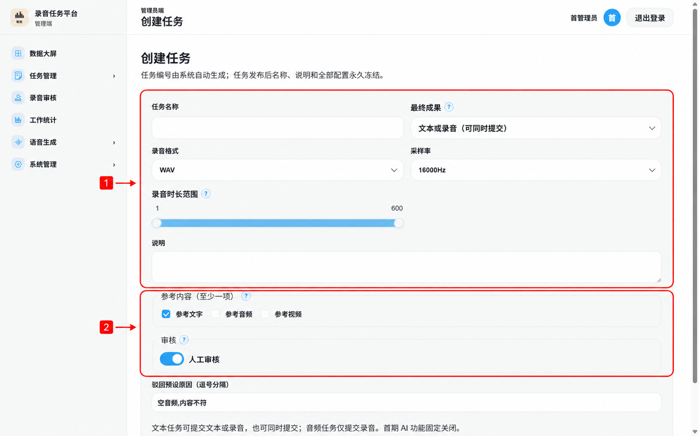

图中编号 1：任务名称、成果类型和录音参数；编号 2：参考类型、人工审核和驳回原因。保存按钮位于页面下方，提交前应完整检查全部字段。

### 4.2 草稿任务

草稿状态可以：

- 编辑名称、说明和任务配置。
- 单条添加数据或导入 CSV。
- 配置采集权限。
- 删除任务。
- 发布任务。

发布前应再次核对成果类型、参考类型、录音格式、采样率和时长范围。任务发布后配置会永久冻结。

### 4.3 运行、暂停和结束

任务状态按以下方式流转：

1. 草稿点击“发布任务”后进入运行中。
2. 运行中可点击“暂停任务”。
3. 暂停后可点击“恢复任务”继续运行，或点击“结束任务”永久结束。

结束任务不能恢复，也不能继续添加数据。进行暂停、结束或删除操作时，按确认弹窗核对任务名称和状态。

## 5. 准备和维护任务数据

适用角色：管理员。

可从任务详情的数据池，或左侧菜单“任务管理” → “任务数据池”进入。

### 5.1 单条添加

1. 打开任务详情。
2. 在“添加数据”区域填写当前任务启用的参考字段。
3. 参考音频和视频只能填写绝对 HTTPS 地址。
4. 点击“添加”。

系统不会主动下载或探测参考音视频地址。请确保地址可由小程序访问，并已配置为微信合法域名。

### 5.2 CSV 批量导入

1. 在任务详情中找到“批量导入”。
2. 点击“下载示例 CSV”。
3. 按固定列填写 referenceText、referenceAudioUrl、referenceVideoUrl。
4. 选择 .csv 文件。
5. 点击“开始导入”。
6. 等待页面显示总行数、成功数和失败数。
7. 如有失败行，可查看脱敏错误摘要并点击“重试失败行”。

单个文件最多包含 50000 行数据。只读取任务已启用的参考列；过滤后整行为空会导入失败。

### 5.3 查询、导出和批量操作

数据池支持按任务、状态、条目编号和脚本来源筛选。可执行：

- 查看条目详情。
- 编辑仍处于可领取状态的参考内容。
- 释放、废弃或恢复符合条件的条目。
- 选择本页数据。
- 选择全部筛选结果并执行跨页批处理。
- 导出符合当前筛选条件的全部 CSV，而不是只导出当前页。

执行跨页操作前，先查看预览中的匹配数量和筛选条件。处理期间其他用户可能改变条目状态，系统会跳过不再符合条件的条目。

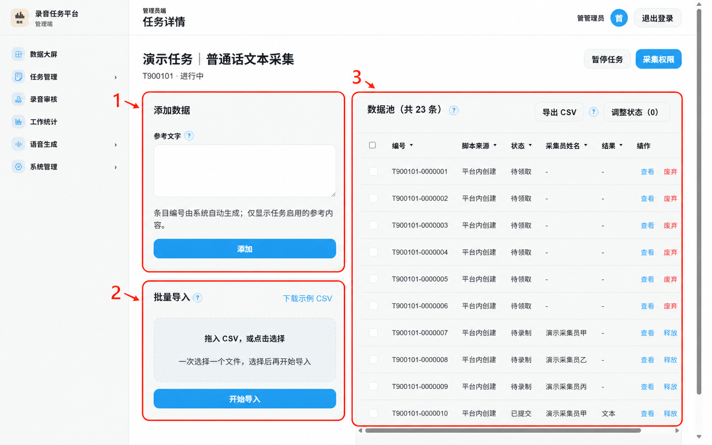

图中编号 1：单条添加参考数据；编号 2：CSV 批量导入；编号 3：数据池查询、查看、释放、废弃和导出区域。

### 5.4 条目详情

条目详情左侧显示参考文本、参考音频 URL 和参考视频 URL；右侧显示条目信息、当前采集结果和最近操作记录。

- 只有允许编辑的状态才显示保存入口。
- 修改或移除历史媒体 URL 后，系统可能异步清理旧媒体。
- 点击“查看更多”可在弹窗中读取完整操作记录。

## 6. 配置采集权限

适用角色：管理员。

入口：左侧菜单“任务管理” → “采集权限”，也可从任务详情点击“采集权限”。

### 6.1 审批申请

1. 选择目标任务。
2. 在“待审批申请”中找到采集员。
3. 核对姓名、用户 ID 和申请时间。
4. 批准或拒绝申请。

### 6.2 直接授权

1. 在小程序用户列表中搜索姓名、用户 ID 或登录账号。
2. 选择目标采集员。
3. 点击授权操作。

撤销授权只会阻止后续领取，不会强制收回采集员已经领取的条目；采集员仍可提交或释放已有条目。

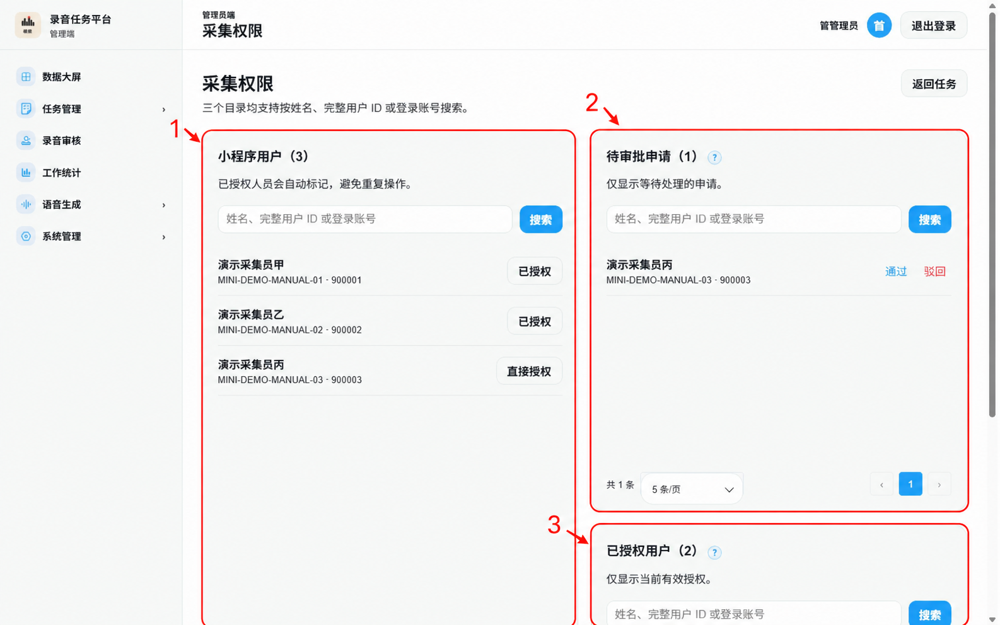

图中编号 1：全部小程序用户；编号 2：待审批申请；编号 3：当前有效授权。批准或撤销前应核对任务和采集员身份。

## 7. 审核录音结果

适用角色：管理员、审核员。

入口：左侧菜单“录音审核”。

### 7.1 选择审核任务

页面展示任务完成度、审核处理进度、待领取、审核中和今日完成等指标。

1. 选择仍有审核积压的任务。
2. 进入任务审核池。

积压清空后，任务仍可能保留在概览中显示真实完成状态，但不会继续作为待办卡展示。

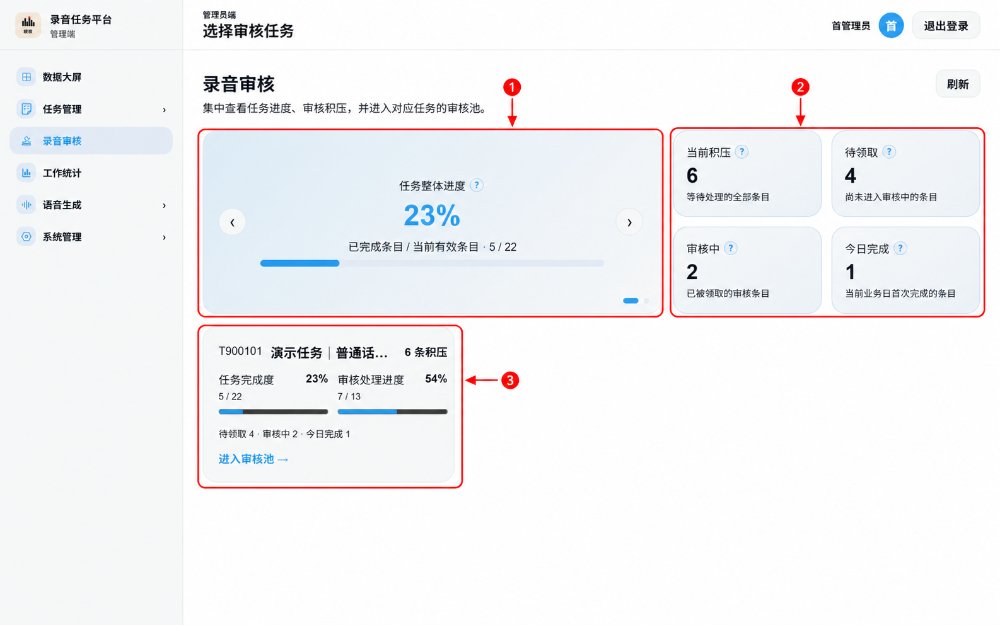

图中编号 1：任务整体进度；编号 2：当前积压、待领取、审核中和今日完成；编号 3：有积压的任务卡及审核池入口。

### 7.2 使用审核池

审核池同时显示“已提交”和“待审核”条目，支持任务内五维筛选和数字分页。

- 单条领取：打开可领取条目进入审核工作台。
- 批量领取或处理：先选中本页或全部筛选结果，再核对预览。
- 筛选变化后，应重新确认当前选中范围。

同一条目只能由一个审核员成功领取。并发操作失败并提示状态已变化时，刷新列表后以最新状态为准。

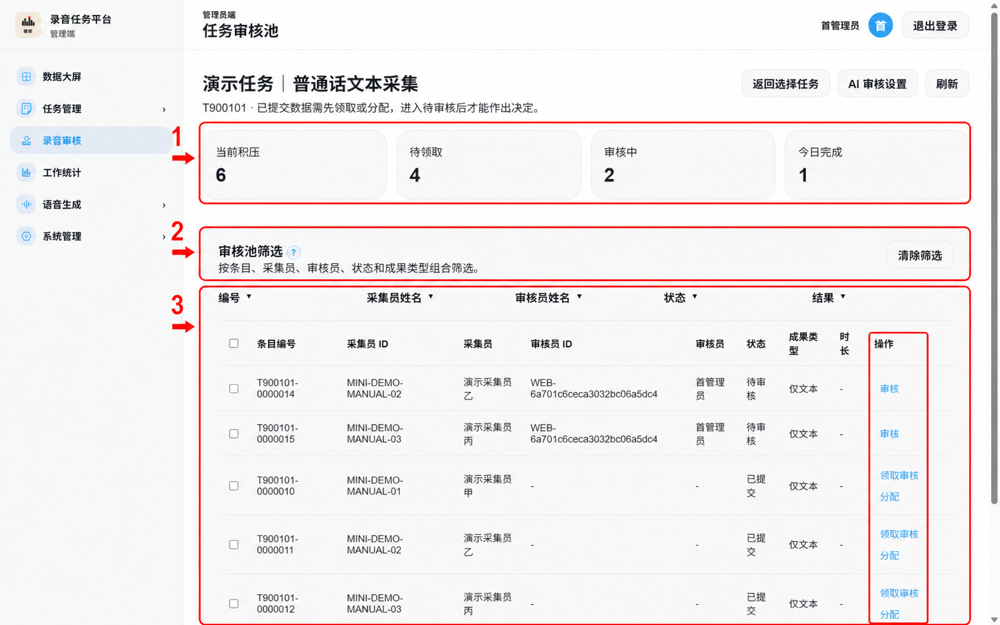

图中编号 1：任务审核指标；编号 2：五维组合筛选；编号 3：审核条目列表及领取、分配或进入审核的操作入口。

### 7.3 审核工作台

工作台左侧固定展示参考文本、参考音频和参考视频；右侧依次展示：

1. 采集员原始提交结果。
2. AI 候选结果（如任务启用）。
3. 可编辑的最终答案。
4. 审核结论。

审核操作：

- 通过：确认最终答案后提交，条目进入已完成。
- 驳回：选择或填写驳回原因，条目进入待返修并保留原采集员。
- 释放审核：将条目退回已提交池，供其他审核员领取。

AI 只提供候选文本，不会自动通过、驳回或保存最终答案。完成 AI 作业后仍需点击“采用结果”，并由人工核对后提交审核结论。

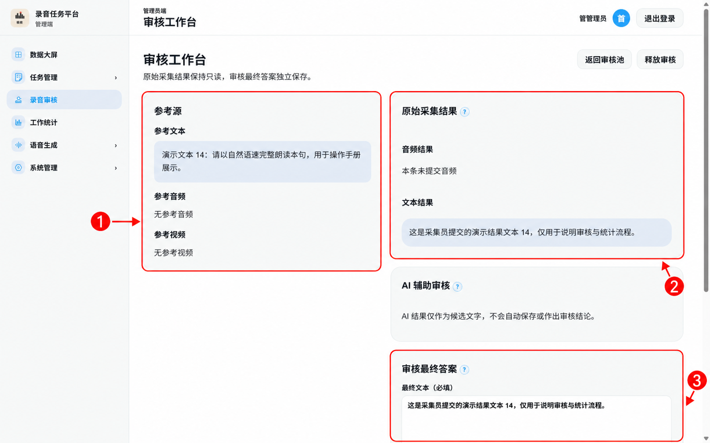

图中编号 1：只读参考源；编号 2：采集员原始结果；编号 3：审核最终答案。审核结论位于页面更下方，提交前必须再次核对。

### 7.4 AI 辅助审核设置

适用角色：管理员。

从任务审核池进入“AI 辅助审核设置”。可配置音频转写和文本修订的模型、提示词和参数。密钥由服务器保存，页面不会显示或接收 API Key。

单条 AI 音频转写上限为 20MB。参数不确定时不要随意修改生产任务配置。

## 8. 查看采集员统计

适用角色：管理员。

入口：左侧菜单“工作统计”。

### 8.1 选择统计范围

1. 先选择任务。
2. 选择“今天”“昨天”“近 7 日”“本月”“全部”或自定义日期。
3. 页面自动刷新统计结果。

提交和完成是两个独立阶段：

- 提交统计按条目第一次提交时间计算。
- 完成统计按条目第一次完成时间计算。
- 平台不计算工资或薪酬。

### 8.2 查看人员详情

点击采集员所在行进入详情页，可查看：

- 提交与完成的分阶段汇总。
- 04:00 至次日 03:00 顺序的小时分布。
- 每日统计。
- 相互独立分页的提交明细和完成明细。
- 当前人员 CSV 导出。

表头点击后按“降序 → 升序 → 默认”循环。切换日期会重置明细页码。

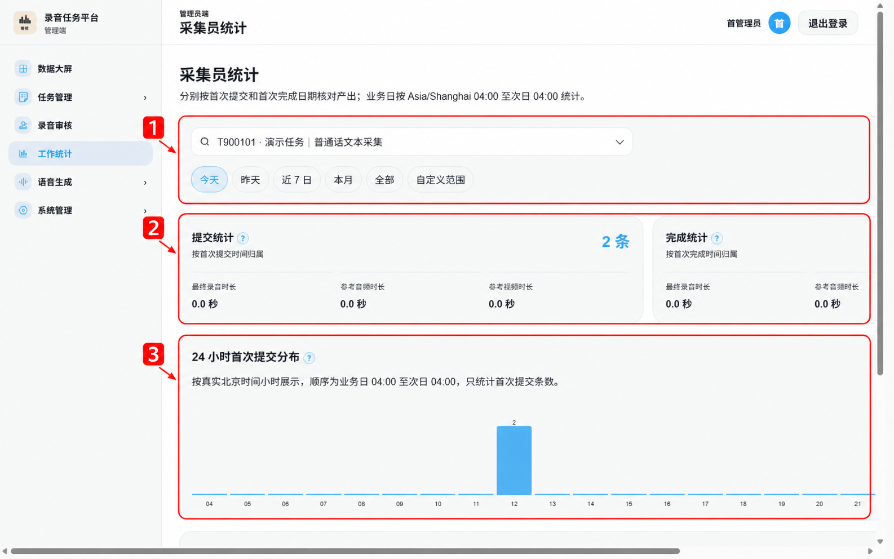

图中编号 1：任务和业务日期筛选；编号 2：提交与完成两个阶段的独立汇总；编号 3：24 小时首次提交分布，继续向下可查看人员排行。

## 9. 使用语音生成

适用角色：管理员。

左侧“语音生成”包含“语音生成工作台”“声音配置”和“生成记录”。

### 9.1 0 元试听和日常合成

1. 选择对应生成模式。
2. 选择声音或填写所需文本。
3. 按需要调整语速、音量和语调。
4. 提交生成。
5. 等待记录完成后试听或下载。

### 9.2 付费克隆

1. 上传 mp3、m4a 或 wav 母带。
2. 确保时长为 10 秒至 5 分钟，文件不超过 20MB。
3. 填写新的音色 ID。
4. 提交克隆。

付费克隆不显示语速、音量或语调参数。音色 ID 必须以英文字母开头，只能包含字母、数字、下划线或连字符，长度为 8–256 个字符，且不能以下划线或连字符结尾。

### 9.3 声音配置和生成记录

- “声音配置”用于维护音色资产和默认声音。
- “生成记录”用于查看生成状态、失败记录、试听和下载。

生成失败时记录会显示失败状态。页面中不会展示 MiniMax API Key。

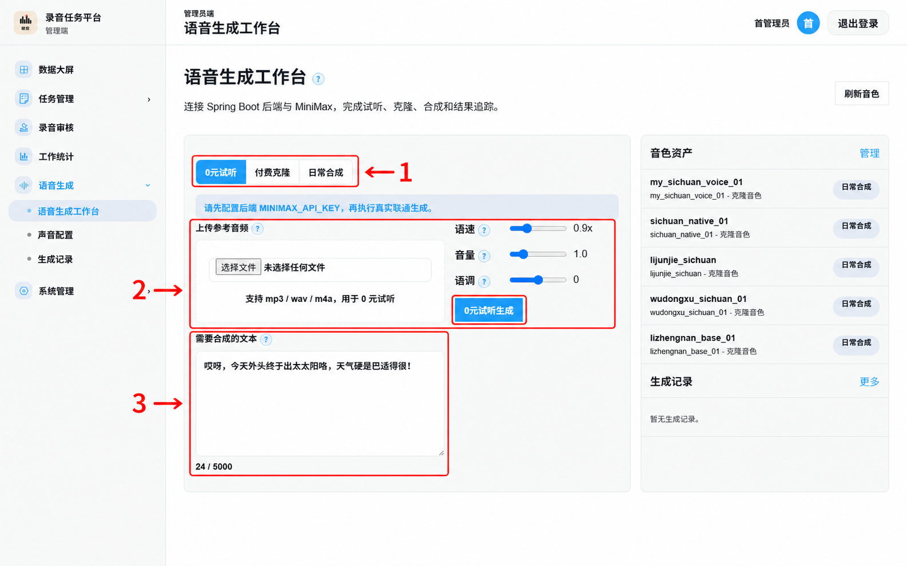

图中编号 1：0 元试听、付费克隆和日常合成模式；编号 2：试听音频及参数；编号 3：待合成文本。截图仅展示操作区域，未调用真实语音生成服务。

## 10. 管理用户和邀请码

适用角色：管理员。

### 10.1 用户管理

入口：“系统管理” → “用户管理”。

页面分为：

- Web 端账号：管理员和审核员。
- 小程序端账号：采集员。

管理员可创建后台账号、搜索用户、重置密码和停用账号；小程序页签还可修改采集员数字登录账号。

重置 Web 密码后，用户下次登录需要处理初始密码提示；重置小程序密码会废止其活动会话。停用用户前应确认其当前工作是否已经交接。

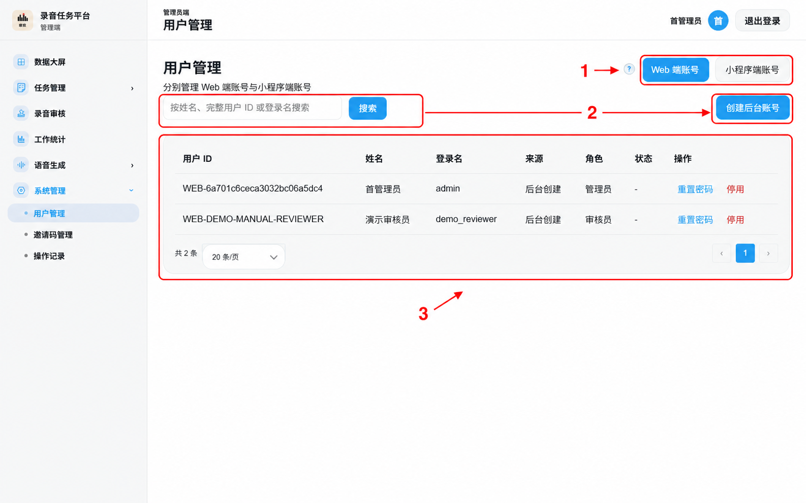

图中编号 1：切换 Web 端账号和小程序端账号；编号 2：搜索或创建后台账号；编号 3：用户列表和账号操作。

### 10.2 邀请码管理

入口：“系统管理” → “邀请码管理”。

1. 点击创建邀请码。
2. 填写名称、可选备注和最大使用次数（1–1000）。
3. 创建后立即复制并安全发送给目标采集员。

完整邀请码只显示一次。列表后续只显示末四位、已使用次数和剩余次数。停用邀请码后不可恢复；停用前应再次确认。

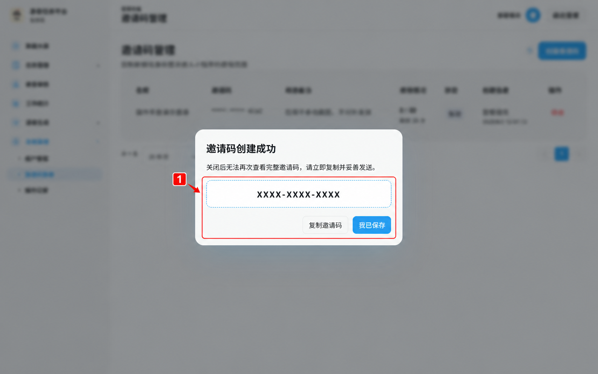

图中编号 1：一次性完整邀请码和复制入口。图中的 `XXXX-XXXX-XXXX` 仅为脱敏示意码，不能用于登录或准入。

## 11. 查看操作记录和个人账号

### 11.1 操作记录

适用角色：管理员。

入口：“系统管理” → “操作记录”。页面按服务端分页显示操作时间、操作人和操作内容，可刷新并切换每页条数；从条目详情也可查看该条目的操作历史。

操作记录用于审计，不用于直接修改业务数据。

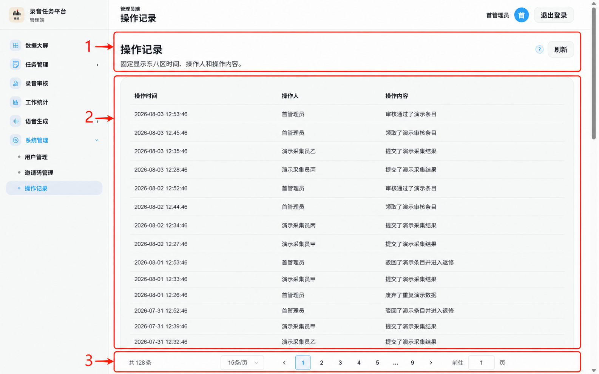

图中编号 1：页面说明和刷新入口；编号 2：按时间倒序展示的操作记录；编号 3：总数、每页条数和翻页区域。

### 11.2 个人账号

适用角色：管理员、审核员。

页面右上角显示当前姓名，并提供“退出登录”。审核员还可从左侧“个人账号”查看姓名、登录账号和角色；管理员当前不显示该侧边栏入口。Web 端当前没有日常自助改密入口，需要重置密码时请联系管理员。

在共享设备使用完毕后务必退出登录。

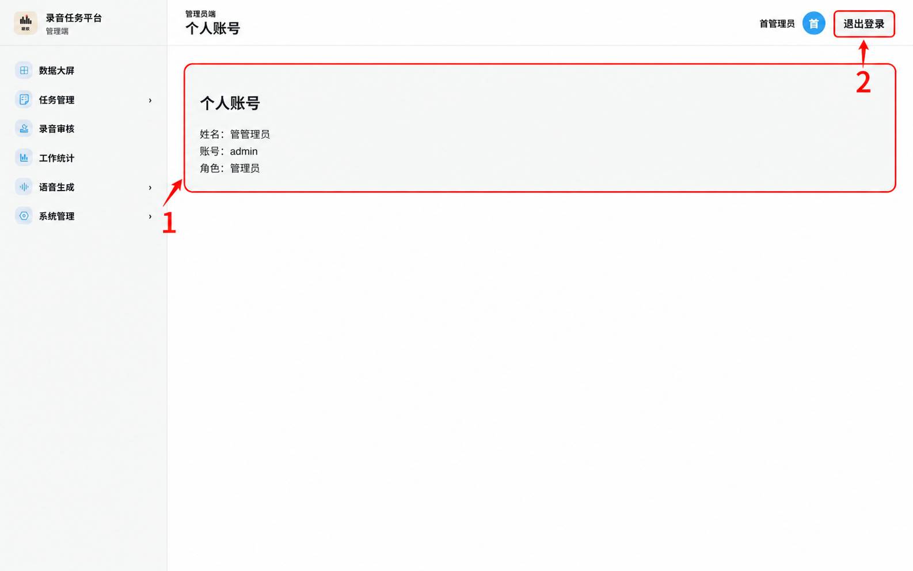

图中编号 1：当前账号的姓名、登录账号和角色；编号 2：安全退出当前会话。

## 12. 常见问题

### 12.1 提示“状态已变化”或 STALE_STATE

其他用户可能已领取、提交或审核同一条目。刷新页面并以最新状态继续，不要反复提交旧页面中的操作。

### 12.2 页面提示无权访问

确认当前账号角色。真实角色越权会被拒绝；管理员功能不会对审核员显示。

### 12.3 列表刷新失败

页面已有数据时，系统会保留旧内容并显示右上角 Toast。检查网络后再次刷新；首次加载完全失败时使用页面中的“重新加载”。

### 12.4 CSV 导入部分失败

查看失败行摘要，重点检查：参考列是否与任务配置一致、HTTPS 地址是否合法、过滤后是否整行为空。修正源文件后重新导入，或使用“重试失败行”。

### 12.5 参考媒体无法播放

确认地址为可公开访问的 HTTPS URL，并已配置微信合法域名。服务端不会代替用户探测或下载远端参考媒体。

### 12.6 统计数量与当前列表不一致

统计按首次提交、首次完成和凌晨 4 点业务日计算，不等同于当前状态列表数量。管理员真正释放回数据池后，原采集员当前统计不再包含该条。

## 13. 截图索引

本手册截图使用本地全虚拟账号、任务和业务结果采集，红框、箭头与编号仅用于指出操作区域。截图中的演示任务编号、用户 ID、账号、文本和邀请码示意码均不对应真实业务数据。

| 页面 | 截图文件 | 主要标注 |
|---|---|---|
| 登录与首次登录 | login-page.png、first-password.png | 登录表单、改密或跳过选择 |
| 数据大屏 | dashboard-overview.png | 指标、趋势和状态分布 |
| 任务管理 | task-list.png、task-create.png、task-detail-data.png | 创建、配置、导入和数据池 |
| 采集权限 | permissions-overview.png | 用户、待审批和已授权 |
| 录音审核 | review-task-select.png、review-queue.png、review-workbench.png | 任务概览、审核池和工作台 |
| 工作统计 | collector-statistics.png | 筛选、阶段汇总和小时分布 |
| 语音生成 | voice-workbench.png | 模式、试听和文本输入 |
| 系统管理 | users-tabs.png、invitation-created.png、operation-logs.png | 用户、邀请码和操作记录 |
| 个人账号 | account-settings.png | 账号信息和退出登录 |
